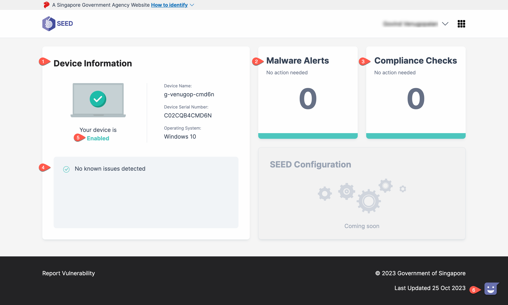

# SEED Dashboard 

The SEED Dashboard helps you to monitor the health status of your GMD device at a glance. It provides key insights of the security issues detected on it. 

Using the SEED Dashboard, you can: 

- View details of your device onboarded to SEED. 

- Respond to potential security threats including malicious activities detected on the GMD. 

- Identify devices that are non-compliant. 

| Legend | Description |
| :--- | :----- |
|  | **Device Information** - This pane displays details of the device onboarded to SEED.  |
|  | **Malware Alerts** - This section displays alerts related to malware detected on the device, categorised as low, medium, or high severity. Click here to view steps for remediation and to understand the nature of the alert. |
|  | **Compliance Checks** -  This section shows detected compliance checks. Click to view the specific compliance requirements that need to be met. |
|  | **Issue updates** - This area provides real-time updates on your device's status. If no issues are detected, it will display "No known issues detected for your device.". If your device is blocked, it will guide you on how to unblock it. For specific issues, such as malware alerts or compliance check failures, further details are available when you click on the corresponding category. |
|  | **Device Status** - This section indicates the current status of your device. There are three statuses: blocked, enabled, and suspended. Hover over the tooltip for explanations of these statuses. |
|  | **Assistance and support** - The purple icon at the bottom right corner allows instant access to SEED's feedback and service request system. |

## View malware alerts

To view malware alerts detected on your device, follow these steps:

1. Click the section labelled **Malware Alerts** to learn more about the detected malware issues, categorised as low, medium, or high severity.
   

2. Upon clicking, you will find two tabs:
    - **Malware Alerts**: This tab displays detailed information about the detected malware alerts.
    

    - **Remediation Steps**: You can find the necessary steps required to fix the malware issue.
    

## View compliance checks

To review your compliance status and view the necessary compliance checks, follow these steps:

1. Click the section labelled **Compliance Checks** to see the compliance checks you need to complete.
    

2. Within this section, there is a **Show Passed Checks** button which displays the compliance checks you have already completed.
    

For more information, refer to the [SEED Dashboard documentation](https://docs.developer.tech.gov.sg/docs/seed-dashboard/).

