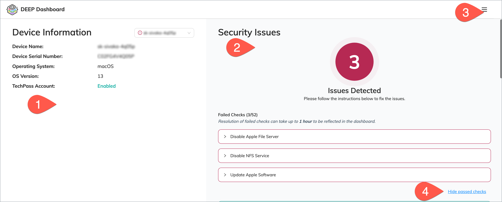

# DEEP Dashboard

[DEEP Dashboard](https://dashboard.deep.tech.gov.sg) is a security system that relies on data and functionality from various services such as: TechPass, Cloudflare, Microsoft Defender, and Microsoft Intune. Its primary objective is to detect potentially insecure devices and prevent them from accessing SEED-protected resources. It also ensures device compliance by measuring configurations against CIS-based benchmarks and automatically correcting non-compliant settings whenever possible.

| **Legend** 	| **Description** 	|
|:---:	|---	|
| 	| Displays information about your device. It provides details such as the device model and operating system version. 	|
| 	| This section highlights any security issues that have been detected on your device. Click the issue to  view the step-by-step instructions on how to resolve it.  	|
| 	| This menu gives options for users to do the following: - report an issue  - provide feedback and  - sign out. 	|
| 	| Click this to show/hide the list of tests or evaluations that have been successfully completed. 	|

## How to access DEEP Dashboard?

You can access DEEP dashboard from the following devices using the [supported browsers](#supported-browsers):

- Device that is connected to Cloudflare WARP
- non-SE GSIB device 

## Supported browsers

- Google Chrome
- Microsoft Edge
- Mozilla Firefox

?> For more information, refer to the [DEEP Dashboard Documentation](https://docs.developer.tech.gov.sg/docs/deep-dashboard-stg/).

