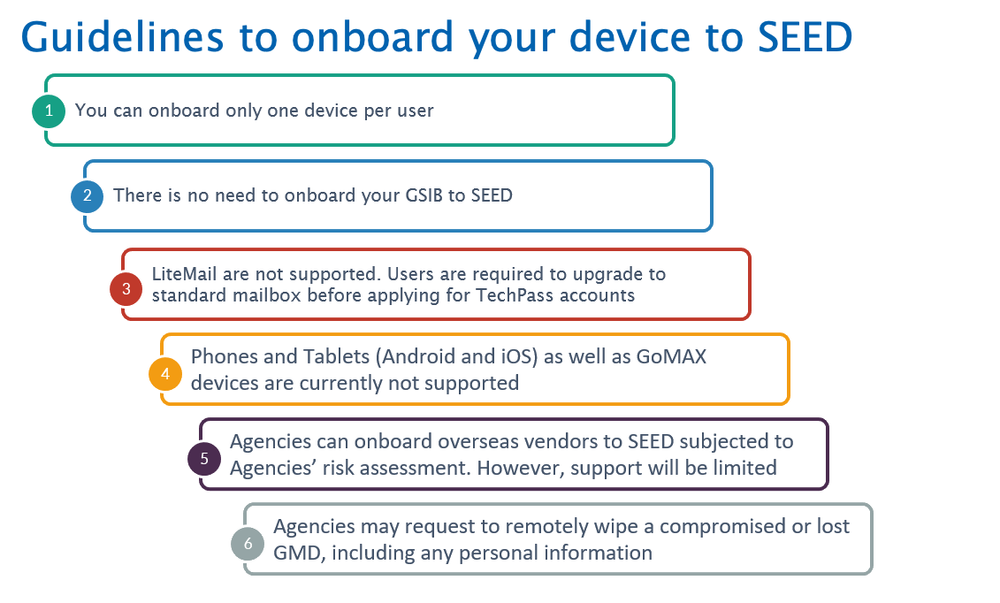

# Getting started

This section provides general guidelines on how to get started with SEED onboarding. It offers essential steps and information to help you begin the onboarding process smoothly. 


```mermaid
%%{init: {'theme': 'default'}}%%
graph LR
    A("Step 0: Complete the prerequisites")
    B("Step 1: Identify your persona")
    C("Step 2: Onboarding to SEED")
    D("Step 3: Post-Onboarding to SEED")
    E("Step 4: Access SEED Dashboard")
    
    style A fill:#f9f, stroke:#333;
    style B fill:#f9f, stroke:#333;
    style C fill:#f9f, stroke:#333;
    style D fill:#f9f, stroke:#333;
    style E fill:#f9f, stroke:#333;
    
    A --> B
    B --> C
    C --> D
    D --> E


  

## Guidelines for onboarding



<a id="step-0-ensure-you-meet-the-required-prerequisites">

## Step 0: Ensure you meet the required prerequisites

</a>

<ul style="list-style-type: disc; margin-left: -3px;">
<li style="margin-bottom:-20px">You need an active <a href="https://docs.developer.tech.gov.sg/docs/techpass-user-guide/onboard-to-techpass">TechPass account</a>.</li>
<li style="margin-bottom:-20px">Request SEED provisioning. </li>
<li style="margin-bottom:-20px">Internet Device running on one of the following operating systems:</li>
    <li style="margin-bottom:-20px">Windows 10 and 11 Pro or Enterprise versions.</li>
    <li style="margin-bottom:-20px">macOS 11 (macOS Big Sur), macOS 12 (macOS Monterey) and macOS 13 (Ventura) versions.</li>
<li style="margin-bottom:-20px">Have administrator permissions on the device.</li>
<li style="margin-bottom:-20px">Remove any existing software on your device such as MDM software, Tanium client or any other unified endpoint management and security platform.</li>
<li style="margin-bottom:-20px">Ensure that System Integrity Protection(SIP) is enabled if you are onboarding a macOS device.</li>
<li style="margin-bottom:-20px">Encrypt hard disk drive to protect the data at rest.</li>
<li style="margin-bottom:-20px">If your organisation uses a firewall or other policies to restrict Internet traffic, you may need to make few changes to allow WARP to connect.</li>  

?> Refer to the [SEED user documentation](https://docs.developer.tech.gov.sg/docs/security-suite-for-engineering-endpoint-devices/prerequisites-for-onboarding) to know how to ensure you meet the prerequisites.

## Step 1: Identify your onboarding persona

To determine if your onboarding persona is that of a **vendor** or a **public officer**, you can refer to your TechPass login ID. The onboarding persona is determined based on your login ID associated with TechPass.

| Onboarding Persona 	| Description 	| Example 	|
|---	|---	|---	|
| Vendor 	| If your TechPass login ID belongs to the domain ```techpass.gov.sg```, you need to onboard your Internet Device to SEED as a vendor. 	| john_doe@techpass.gov.sg 	|
| Public officer 	| If your TechPass login ID is the same as your organisational email address (WOG account), you need to onboard your Internet Device to SEED as a public officer. 	| john_doe@moe.gov.sg<br>john_doe_from.cognizant@tech.gov.sg 	|

## Step 2: Onboard device to SEED

The onboarding process consists of the following steps:

1. Set up Microsoft Intune on your device. If you are onboarding as a vendor, all the necessary applications and device configurations will be provided when you set up Intune.

2. If you are onboarding as a public officer, you need to register the Intune Device ID on the [TechPass portal](https://portal.techpass.gov.sg/secure/account/profile) from your non-SE GSIB device. This step ensures that the required applications and device configurations are installed on your device. 

?> **Note**<br>- If you are a SE GSIB device user, please submit a [support request](https://go.gov.sg/seed-techpass-support) to register your Intune Device ID. <br>- Ensure that the device you are onboarding remains connected to the internet until you receive the confirmation email indicating successful onboarding.<br>- Public officers who are undergoing the onboarding process can check their onboarding status on the TechPass portal.<br>- Please be aware that onboarding may fail due to various reasons. In such cases, we will provide the specific onboarding status and the necessary action required from you to resolve the issue. 

3. When your onboarding is successfully completed, a confirmation email will be sent to the email address linked to your TechPass account.

4. Verify that the required profiles have been installed on your device.

?> For step-by-step instructions tailored to your specific onboarding persona, please refer to the [SEED Documentation](https://docs.developer.tech.gov.sg/docs/security-suite-for-engineering-endpoint-devices/onboard-device/onboard-device-to-seed). It provides comprehensive guidance to assist you throughout the onboarding process.

  


