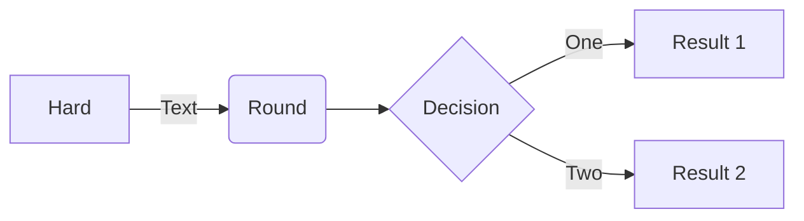

 # Identify your seed onboarding persona

 Depending on your TechPass ID, you need to onboard your Internet Device to SEED as a public officer or vendor.

|TechPass domain format|  TechPass ID example|     SEED onboarding persona |
 |--|--|--|
 |techpass.gov.sg| john_doe@techpass.gov.sg | Vendor |
 |&lt;agencycode&gt;.gov.sg | john_doe@cpf.gov.sg<br>john_doe@moe.gov.sg<br>john_doe_from.thoughtworks@tech.gov.sg | Public officer |

<!--


 ```mermaid
%%{ init: { 'flowchart': { 'curve': 'linear'}} }%%
flowchart LR
A-->B;
B-->C;
C-->D;
```



```mermaid
graph LR;
A[Hard] --\>|Text| B(Round)
B --\> C{Decision}
C --\>|One| D[Result 1]
C --\>|Two| E[Result 2]
```


This will generate a flowchart diagram with four nodes labeled "Hard," "Round," "Decision," "Result 1," and "Result 2," where "Hard" is connected to "Round" with a "Text" label, "Round" is connected to "Decision," "Decision" is connected to "Result 1" with a "One" label, and "Decision" is connected to "Result 2" with a "Two" label.

-->


