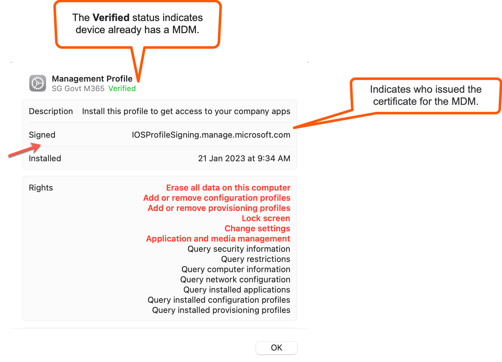

# Remove existing software on your device

If your Internet Device has the following software, remove them before onboarding to SEED. 

- Existing MDM on the device
- Tanium Client of any Unified Endpoint Management (UEM) and Security Platforms
- Cloudflare WARP or any other software that provides secured and private connections
- Microsoft Defender or any other antivirus solution

<!-- tabs:start -->

#### **macOS**

<details>
  <summary style="font-size:18px">a. Verify if your device is already managed by any MDM software</summary><br>

  1. Go to the **Apple** menu > **System Settings** > **Privacy and Security**. 
  2. On the right-side menu, scroll down and click **Profiles**.
  3. Double-click **Management Profile**.

  <kbd></kbd>

?>**Notes**<br><br>- If the status is **Unverified**, it confirms your device is not managed by any MDM currently and you may proceed to step **c.Remove Tanium Client**.<br><br>- If you see the ```iosprofilesigning.manage.microsoft.com``` certificate, it indicates that **Microsoft Intune** is your MDM. Proceed to **step b. Unenrol from Microsoft Intune**.<br><br>- If you have an MDM other than Microsoft Intune, contact your organisation's IT administrator to unenrol your device from it.

</details>
<details>
  <summary style="font-size:18px">b. Unenrol from Microsoft Intune</summary><br>

  1. Click the **Spotlight** icon or press the ``Command+Spacebar`` to open the **Spotlight Search**.
  2. Enter **Company Portal**.
  3. Sign in to **Company Portal**.
  <kbd></kbd>
  4. Go to **Devices** and click the three dots beside the device you want to unenrol.
  5. Choose **Remove**.
  <kbd></kbd>
  6. When prompted to confirm the removal, select **Remove**.
  7. Click your profile icon and **Sign out** of **Company Portal**.

</details>

<details>
  <summary style="font-size:18px">c. Remove Tanium Client</summary><br>

  1. Open **Terminal** and run the following command:

   ```
  sudo ls /Library/Tanium/TaniumClient
   ```
  2. If prompted for password, enter your macOS password.

  3. If you see the below on your **Terminal**, it indicates that Tanium Client is installed on your device and go to step 3. If not, proceed to step d. **Remove Cloudflare WARP client**.

   <kbd></kbd>

  4. Run the following commands on the **Terminal**.
   ```
     sudo launchctl unload /Library/LaunchDaemons/com.tanium.taniumclient.plist

     sudo launchctl remove com.tanium.taniumclient > /dev/null 2 >&1

     sudo rm /Library/LaunchDaemons/com.tanium.taniumclient.plist

     sudo rm /Library/LaunchDaemons/com.tanium.trace.recorder.plist

     sudo rm -rf /Library/Tanium/

     sudo rm /var/db/receipts/com.tanium.taniumclient.TaniumClient.pkg.bom

     sudo rm /var/db/receipts/com.tanium.taniumclient.TaniumClient.pkg.plist

     sudo rm /var/db/receipts/com.tanium.tanium.client.bom

     sudo rm /var/db/receipts/com.tanium.tanium.client.plist

    ```

4. Enter your macOS password when prompted. Once the commands are successfully executed, Tanium Client is removed from your device.

</details>
<details>
  <summary style="font-size:18px">d. Remove Cloudflare WARP Client</summary><br>

  1. Click the **Finder** icon in the **Dock**.
  2. Choose **Applications**.
  3. Search for **Cloudflare WARP.app**.
  4. If available, open **Terminal** and run the following command:
    ```
    sudo /bin/sh /Applications/Cloudflare\ WARP.app/Contents/Resources/uninstall.sh
    ```
    5. When prompted, enter your macOS password.

</details>
<details><summary style="font-size:18px">e. Remove Defender or the current antivirus solution</summary><br>


  > **Note**:
  > The following steps are to remove Defender from your device. If you have other antivirus solution, contact your administrator to remove it.

  1. Open **Terminal** and run `mdatp health`. If you get a `mdatp: command not found` error, you do not have Defender installed on your device and can skip the steps in this section.
  2. Take note of the value displayed for **org_id**.
  3. Identify the organisation corresponding to this **org_id** from the following table. This is the organisation of the Defender or the antivirus on your device.

  | org_id  | Organisation |
  | ------------- |:-------------:|
  | faa36a5e-2da6-4225-8e27-226177c801a0      | WOG     |
  | 49237d71-42ac-425a-a803-881b92cc18ce  | TechPass    |
  | 6389e966-e334-461d-86ce-0fed12484620      | Hive     |

  > **Note**:
  > If your organisation id(org_id) is different from the above three, contact the respective MDM administrator to get the offboarding script.

  4. Based on the organisation, use the internet (which is not a GSIB) device to download the offboarding script from the following:

    | Organisation  | Offboarding script |
    | ------------- |:-------------:|
    | WOG      | [Download offboarding script](https://26mucnez5qtouxu6dtg7bwcpwa0glupx.lambda-url.ap-southeast-1.on.aws/wog_mac)    |
    | TechPass      | [Download offboarding script](https://26mucnez5qtouxu6dtg7bwcpwa0glupx.lambda-url.ap-southeast-1.on.aws/tp_mac)     |
    | Hive      | [Download offboarding script](https://26mucnez5qtouxu6dtg7bwcpwa0glupx.lambda-url.ap-southeast-1.on.aws/hive_mac)     |

  5. When prompted, log in with your TechPass.

  > **Note**: If you have any issues in accessing the link to download the offboarding script,
  >- Make sure that you are using your internet (which is not a GSIB) device to download the offboarding script.
  >- Access the link in incognito mode.
  >- Make sure you are using only the [supported browsers](https://docs.developer.tech.gov.sg/docs/security-suite-for-engineering-endpoint-devices/additional-resources/best-practices?id=supported-browsers).
  >- If you still have issues in downloading the script, create a [support request](https://go.gov.sg/techpass-sr).

  6. Save the offboarding script to the **Downloads** folder.

    > **Note**:
    > Check if the script that you received has not yet expired. The expiry date is indicated on the file name. For example, wog_mac_valid_until_2021-11-10.sh

  7. Go to **Terminal** and run the following command:
      ```
      sudo /bin/sh ~/Downloads/<name_of_offboarding_script.sh>
      ```
    >- **Note:**
    > The file name *name_of_offboarding_script* in this command is only an example. When you run the command, specify the file name of the offboarding script you downloaded.

  8. Go back to the **Finder** icon in the **Dock**.

  9. Choose **Applications** and search for **Microsoft Defender for Endpoint.app**.

  10. Drag the app to the Bin, or select the app and choose **File** > **Move to Bin**.

</details>


#### **Windows**

<details>
  <summary style="font-size:18px">a. Remove existing MDM software</summary>

  1. Click **Start** icon on the taskbar.
  2. Go to **Settings** > **Accounts**.
  3. From the left menu, choose **Access work or school**.

  ?> If your device is managed by an MDM, your username in your organisation's domain will be displayed under **Work or school account**.

  4. Click **Work or school account** and then select **Disconnect**.


</details>

<details>
  <summary style="font-size:18px">b. Remove Tanium Client</summary>

  1. Click **Start** icon on the taskbar.
  2. Go to **Settings** > **Apps** and search for **Tanium Client**.
  3. If available, choose it and then click **Uninstall**.

</details>

<details>
  <summary style="font-size:18px">c. Remove Cloudflare WARP Client</summary>

  1. Click **Start** icon on the taskbar.
  2. Go to **Settings** > **Apps** and search for **Cloudflare WARP**.
  3. If available, choose **Cloudflare WARP** and then click **Uninstall**.

</details>
<details>
  <summary style="font-size:18px">d. Remove current antivirus solution on the device</summary><br>

  1. In the search box on the taskbar, type **regedit**.
  2. Choose **Registry Editor** from the results and click **Run as administrator**.
  3. In the **Registry Editor**, go to **Computer** > **HKEY_LOCAL_MACHINE** > **SOFTWARE** > **Microsoft** > **Windows Advanced Threat Protection** > **Status**.

  > **Note**:
  > If you do not see the **Windows Advanced Threat Protection** folder, it indicates your device is not enrolled with any MDM solution. Proceed to onboard your device to SEED.

  4. Take note of the value displayed for **OrgId**.
  5. Identify the organisation corresponding to this **OrgId** from the following table. This is the organisation of the Defender or the antivirus on your device.

  | OrgId  | Organisation |
  | ------------- |:-------------:|
  | faa36a5e-2da6-4225-8e27-226177c801a0      | WOG     |
  | 49237d71-42ac-425a-a803-881b92cc18ce  | TechPass    |
  | 6389e966-e334-461d-86ce-0fed12484620      | Hive     |

  > **Note**:
  > If your organisation id(OrgId) is different from the above three, contact the respective MDM administrator to get the offboarding script.

  6. Based on the organisation, use your internet (which is not a GSIB) device to download the offboarding script from the following:

  | Organisation  | Offboarding script |
  | ------------- |:-------------:|
  | WOG      | [Download offboarding script](https://26mucnez5qtouxu6dtg7bwcpwa0glupx.lambda-url.ap-southeast-1.on.aws/wog_windows)    |
  | TechPass      | [Download offboarding script](https://26mucnez5qtouxu6dtg7bwcpwa0glupx.lambda-url.ap-southeast-1.on.aws/tp_windows)     |
  | Hive      | [Download offboarding script](https://26mucnez5qtouxu6dtg7bwcpwa0glupx.lambda-url.ap-southeast-1.on.aws/hive_windows)     |

  7. When prompted to log in, log in with your TechPass.

  > **Note**: If you have any issues in accessing the link to download the offboarding script,
  >- Make sure that you are using your internet (which is not a GSIB) device to download the offboarding script.
  >- Access the link in incognito mode.
  >- Make sure you are using only the [supported browsers](https://docs.developer.tech.gov.sg/docs/security-suite-for-engineering-endpoint-devices/additional-resources/best-practices?id=supported-browsers).
  >- If you still have issues in downloading the script, create a [support request](https://go.gov.sg/techpass-sr).

  8. Save the offboarding script in your **Downloads** folder.

  > **Note**:
  > Check if the script that you received has not yet expired. The expiry date is indicated on the file name. For example, *wog_windows_valid_until_2022-09-07.cmd*.

  9. Go to **Start** and type **cmd**.
  10. Right-click on **Command Prompt** and select **Run as administrator**.
  11. If prompted, enter your Windows password.
  12. Run the following commands:
     ```
     cd "%USERPROFILE%\Downloads\"

     .\<name_of_offboarding_script.cmd>
     ```
> **Note:**
> Name of the .cmd file mentioned in this command is only an example. When you run the command, specify the file name of the offboarding script you downloaded.  

</details>  


<!-- tabs:end -->


